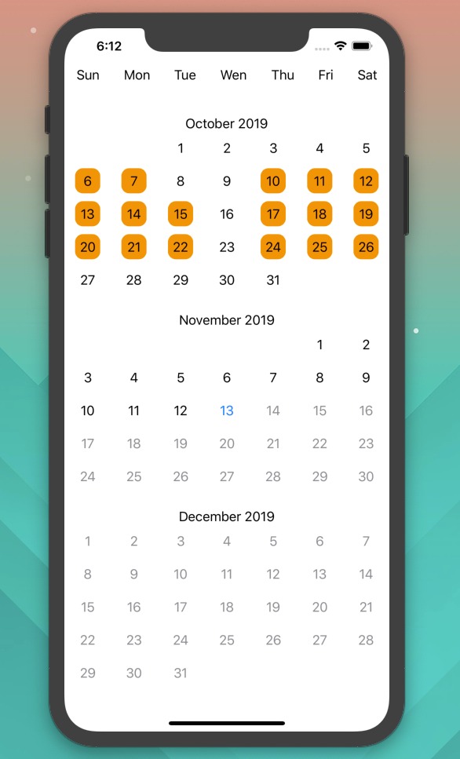
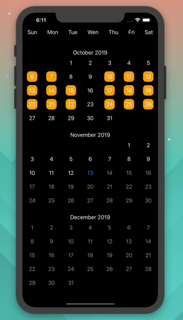

# MonthCal
**A SwiftUI Calendar Generator for IOS**

## Features:
- Supply starting date
- Select months to display
- Disabled, Enabled, Selected, Today day states
- Color control
- Dark Mode Support

## Photos



## Installation
- Requires IOS 13.0+ / Xcode 11+ / Swift 5.1+

### Option 1
- Copy `Sources/MonthCal` source files into your xcode project

### Option 2
- Add via Swift Package Manager

### Configure
- To customize the colors used, edit colors listed in the `Colors.swift` file

### Usage
- Show calendar with a start date and amount of months to display
```
Import MonthCal
CalendarView(start: Date(), monthsToShow: 6)
```

- Disable ability for dates to be selected
```
Import MonthCal
CalendarView(start: Date(), monthsToShow: 6, daysSelectable: false)
```

## License
- MonthCal is available under the MIT license.  See the `LICENSE` file for more info.

## Shoutouts
- Paul Hudson - [@twostraws](https://twitter.com/twostraws) - https://www.hackingwithswift.com/100/swiftui
- RaffiKian - https://github.com/RaffiKian/RKCalendar - Inspiration 
